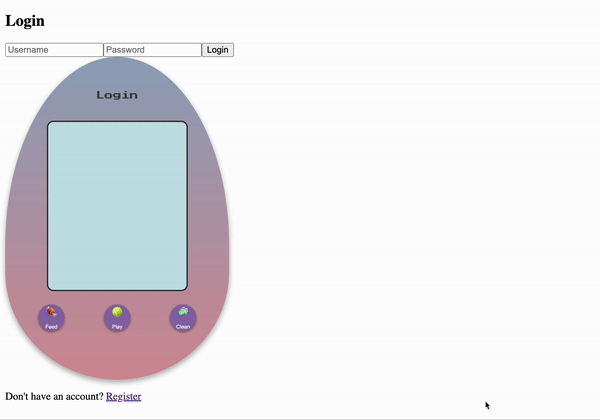
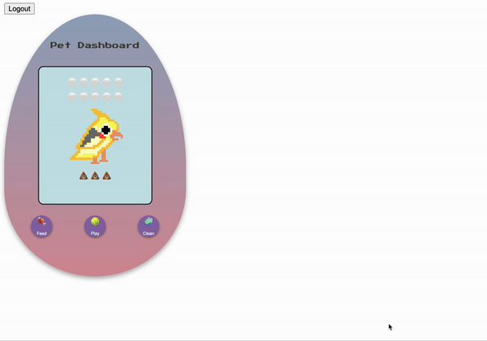
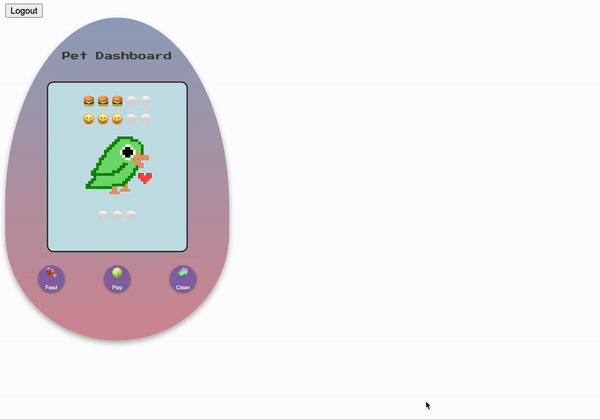

# Pet App Frontend

This is the frontend code for the **Pet App**, a virtual pet experience inspired by the Tamagotchi, where users can take care of a digital pet's basic needs such as feeding, playing, and cleaning up after it. This application is built with React and provides an interactive, Tamagotchi-style interface.

## Table of Contents

- [Features](#features)
- [Technologies](#technologies)
- [App Demo](#app-demo)
- [Getting Started](#getting-started)
  - [Prerequisites](#prerequisites)
  - [Installation](#installation)
- [Project Structure](#project-structure)
- [Key Components](#key-components)
- [Available Scripts](#available-scripts)
- [API Endpoints](#api-endpoints)
- [Deployment](#deployment)
- [Future Improvements](#future-improvements)
- [License](#license)

## Features

- **Display Pet’s Status**: Shows pet's current hunger, happiness, poop, and other attributes.
- **Basic Actions**: Feed, play, and clean up after the pet.
- **Memory Game**: Mini memory game to increase pet's happiness. The amount of happiness increased depends on the level successfully completed. It can be accessed under the 'Play' option, under the '🃏' option.
- **Health Monitoring**: Pet's happiness, hunger, and poop are automatically updated periodically and the health determined from there.

## Technologies

This project was built with the following technologies:

- **React** - JavaScript library for building user interfaces
- **React Router** - For client-side routing and navigation between components
- **Axios** - HTTP client for making API requests
- **CSS** - Styling for component layout and animations
- **JavaScript (ES6+)** - Core programming language for frontend logic and interactivity
- **Express.js** - Backend framework for handling API requests (for pet stats and user management)
- **MongoDB** - NoSQL database for storing pet and user data
- **Node.js** - JavaScript runtime for backend development
- **JWT (JSON Web Tokens)** - For user authentication and authorization
- **Vercel** - Deployment platform for both frontend and backend
- **GitHub** - Version control and code hosting

## App Demo

## Live Demo

A live demo of the app is available here:

[Frontend (User Interface)](https://pet-app-frontend-drab.vercel.app/)

### Registration and Login Dashboard



### Pet Dashboard



### Memory Game Console



## Getting Started

### Prerequisites

To run this project locally, you’ll need:

- **Node.js** (v14+ recommended)
- **npm** (or yarn, if preferred)

### Installation

1. **Clone the repository**:

   ```bash
   git clone <repo-link>
   cd pet-app-frontend
   ```

2. **Install dependencies:**

    ```bash
    npm install
    ```

3. **Environment Variables:** Create a `.env` file in the root directory and set up your backend API endpoint:

    ```env
    REACT_APP_API_URL=http://localhost:4000
    ```

4. **Run the Application:**

    ```bash
    npm start
    ```

5. **Access the app:** Open <http://localhost:3000> to view it in the browser.

## Project Structure

```plaintext
pet-app-frontend/
├── public/
│   └── index.html
├── src/
│   ├── components/       # UI components
│   ├── App.js            # Main app component
│   ├── index.js          # Entry point
│   └── ...
├── .env                  # Environment variables
├── package.json
└── README.md
```

## Key Components

The app has three main routes and several components organized to handle various pet interactions and UI elements.

### Routes

1. **`Login`**: Handles user authentication and login.
2. **`Register`**: Manages new user registration.
3. **`PetDashboard`**: Main dashboard where users interact with their pet.

### Components in `PetDashboard`

- **`PetConsole`**: Main console interface for viewing and interacting with the pet's stats.
- **`PlayConsole`**: Interface to initiate play activities with the pet.
- **`FeedConsole`**: Console for selecting different types of food to feed the pet.
- **`MemoryGameConsole`**: A mini memory game interface that boosts pet happiness upon success.

### Additional Components

- **`Pet`**: Responsible for displaying the pet’s image and updating its state based on actions.
- **`IndicatorBar`**: Dynamically displays the pet's happiness, hunger, and cleanliness levels using bars that adjust in real-time. Icon and number of elements in the bar are provided as props.
  - **Happiness Bar**: Visual indicator of the pet’s happiness level.
  - **Hunger Bar**: Shows the pet’s current hunger status.
  - **Poop Bar**: Represents cleanliness status, indicating when the pet needs cleaning.

Each component is modular, focusing on a specific aspect of the pet's care, making it easy to add more interactive features or extend current ones.

## Available Scripts

In the project directory, you can run:

- `npm start`: Runs the app in the development mode.
- `npm run build`: Builds the app for production to the build folder.
- `npm test`: Launches the test runner.

## API Endpoints

The backend API provides various endpoints to interact with the pet application, including user authentication and pet management. Below is a list of the available endpoints and their descriptions.

### Authentication Endpoints

- **POST `/api/register`**  
  Registers a new user and creates a new pet associated with this user.  
  - **Request Body**: `{ "username": "string", "password": "string" }`  
  - **Response**: Returns the created user’s ID and a success message.  
  
- **POST `/api/login`**  
  Authenticates a user and provides a JWT token for secure access.  
  - **Request Body**: `{ "username": "string", "password": "string" }`  
  - **Response**: Returns a JWT token upon successful login, as well as the user’s ID.

### Pet Endpoints

- **GET `/api/pets/user/:userId`**  
  Retrieves the pet associated with the specified `userId`.  
  - **Path Parameter**: `userId` – ID of the user whose pet is to be retrieved.  
  - **Response**: Returns the pet details.

- **GET `/api/pets/:id`**  
  Retrieves a pet by its unique pet ID.  
  - **Path Parameter**: `id` – ID of the pet to retrieve.  
  - **Response**: Returns the pet details.

- **PUT `/api/pets/:id`**  
  Updates pet stats or other properties. Requires authentication.  
  - **Path Parameter**: `id` – ID of the pet to update.  
  - **Request Body**: Can include properties like `hunger`, `happiness`, or `health`.  
  - **Response**: Returns the updated pet details.

- **POST `/api/pets/reset`**  
  Resets all pet states to default values (protected endpoint, accessible only via an admin key).  
  - **Headers**: `{ "Authorization": "Bearer <fixed-auth-key>" }`  
  - **Response**: Returns a message confirming that all pets have been reset.

### Notes

- All protected routes require a valid JWT token in the request headers (`Authorization: Bearer <token>`).
- Ensure to replace `<fixed-auth-key>` and `<token>` with actual values when making requests to restricted endpoints.

## Deployment

1. Build the app:

    ```bash
    npm run build
    ```

2. Deploy to Vercel or any static hosting provider by following their instructions for deploying React applications.

## Future Improvements

- Additional Mini-Games: Add more variety to interact with the pet.
- Enhanced Animations: Visual feedback for each action.
- Level System: A progression system to unlock new features.
- Perhaps move more game logic to backend.

## License

This project is licensed under the MIT License.
